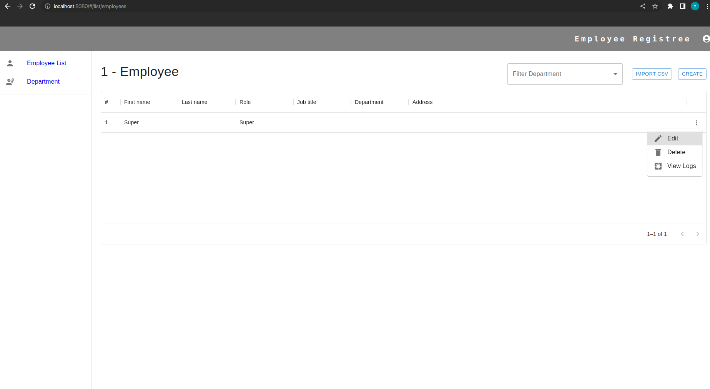
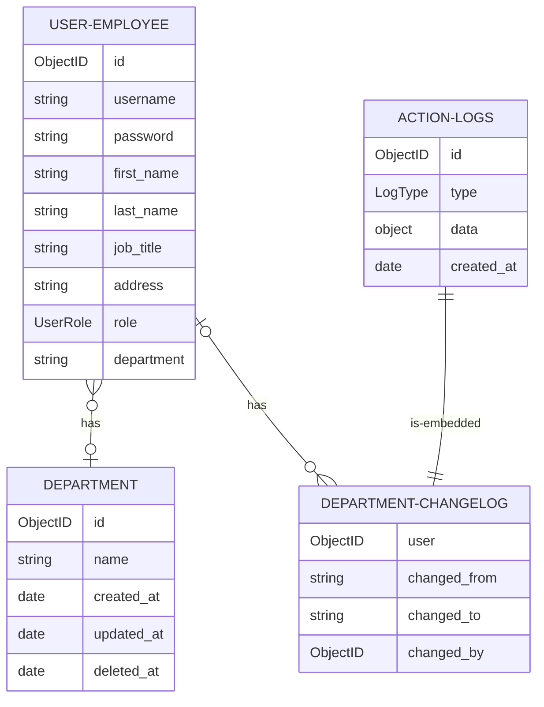
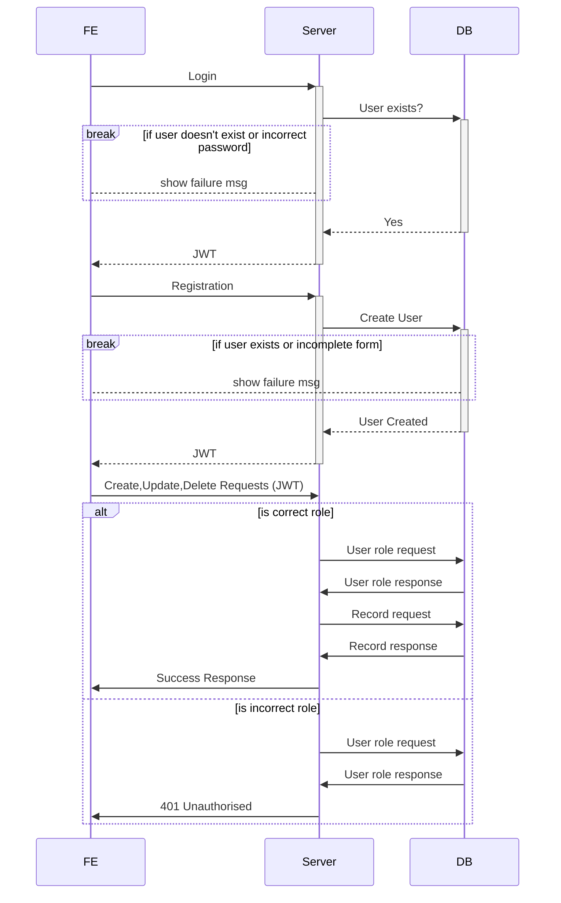

# employee-registree
An application to help with employees and department management.

## Getting Started

* Pull the project with git command
    SSH
    ```
    git@github.com:YogirajT/employee-registree.git
    ```
    OR HTTP
    ```
    https://github.com/YogirajT/employee-registree.git
    ```

* Get docker-compose for your machine

    ex. For Ubuntu refer
    ```
    https://www.digitalocean.com/community/tutorials/how-to-install-docker-compose-on-ubuntu-18-04
    ```

* Run command 
    ```
    sudo docker-compose up
    ```

* After the installation completes the server should be available on 
    ```
    http://localhost:8080
    ````

* Postman collection of APIs can be found at.
    ```
        .__docs__/employee-registree.postman_collection.json
    ```

## Usage

* When the server starts for the first time a super-user record is create with ID: `super` and password: `super`
* Super user can be used to add users and change Roles of other users.
* By default Frontend runs on `http://localhost:8080` Backend on `http://localhost:8081` and mongodb on `mongo1:27017`

<picture>
  
</picture>

## Technical Docs

* Passport JWT strategy is being used for authentication and authorization
* All deletes are soft deletes.

** ID key has a _ suffix. (need to figure out how mermaid JS escapes special chars)





## Yarn monorepo folder structure

|  |  |  |  |  |
| ------ | ------ | ------ | ------ | ------ |
| \_\_docs\_\_ | documentation folder  |  |  |
| backend  |   |
|   | \src  | BE source code |
|   |  | \common | shared classes (IoC containers, logging etc.) |
|   |  | \database | models and DB connection handler |
|   |  | \domain | business logic |
|   |  | \presentation | routes, controllers and app bootstrapping logic |
|   |  | \repositories | repositories of DB tables |
|   |  | \service | service later to communicate with repo and domain |
|   |  | \service | service later to communicate with repo and domain |
|   |  | \types | TS typing |
|   |  | Env | BE env Class |
|   |  | index | BE entry point |
|   |  | Dockerfile |  |
|   |  | package.json |  |
|   |  | tsconfig.json |  |
|   |  | yarn.lock |  |
| frontend  |  |  |
|   |  \src | FE source code |
|   |  | \common | shared components
|   |  | \components | Router entry components for different pages
|   |  | \fonts | custom fonts
|   |  | \images |
|   |  | \state | Redux and Saga state management Components
|   |  | \utils | utility functions
|   |  | \App.jsx | App entry.
|   |  | \Routes.jsx | FE Routes
|   |  | \StoreSetup.jsx | Redux store, history and hashrouter setup
|   |  | \index.jsx | App entry point
|   |  \public | react public files |
| packages  |   | common modules |
|  | \config  | BE + FE common interfaces and shared code |
| .docker-compose  |   | docker orchestrator |
| .docker-compose  |   | docker orchestrator |
| .package.json  |   |  |
| .yarn.lock  |   |  |


## Addition Info

* Details of BE structure and architecture can be found here
[Layered architecture](https://www.oreilly.com/library/view/software-architecture-patterns/9781491971437/ch01.html)
